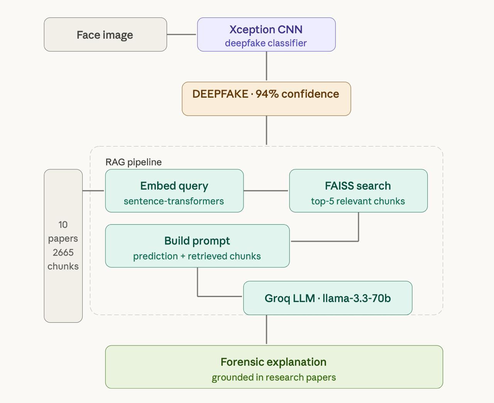

# Explainable Deepfake Detection with RAG

A deepfake detection system combining an **Xception CNN** classifier with a **Retrieval-Augmented Generation (RAG)** pipeline to produce grounded forensic explanations for every prediction — built from scratch without LangChain.


---

## Architecture



---

## How Deepfakes Work

A deepfake is a face image or video generated or manipulated by a Generative Adversarial Network (GAN). Two networks compete:

- **Generator** — creates fake faces
- **Discriminator** — tries to detect fakes

They train together until the generator fools the discriminator. The result looks real to the human eye but leaves behind subtle artifacts from the generation process.

## GAN Artifacts This System Detects

1. **Eye inconsistencies** — Reflections, gaze direction, and blinking patterns are often unnatural or asymmetric between left and right eye.
2. **Blending boundaries** — Color and texture inconsistencies appear around the jaw, hairline, and neck where the fake face meets the original.
3. **High frequency noise** — Unnatural frequency patterns invisible to the human eye but detectable via FFT analysis.
4. **Upsampling artifacts** — Checkerboard patterns from GAN upsampling at pixel level.
5. **Facial asymmetry** — GAN faces are often unnaturally symmetric or asymmetric in ways real faces are not.
6. **Temporal inconsistencies** — In videos, deepfake faces flicker or transition unnaturally between frames.

---

## Knowledge Base

RAG retrieves from a knowledge base built from 10 peer-reviewed papers:

| Paper | Year |
|-------|------|
| FaceForensics++ | 2019 |
| DeepFakes and Beyond Survey | 2020 |
| Xception | 2017 |
| Watch Your Up-Convolution | 2020 |
| Deepfake Generation and Detection Survey | 2024 |
| FreqNet Frequency-Aware Detection | 2024 |
| Deepfake Detection Reliability Survey | 2022 |
| Tug of War Deepfake Detection | 2024 |
| Deepfake Detection in Generative AI Era | 2024 |
| RAG — Lewis et al. | 2020 |

The knowledge base can be updated at any time by adding new papers and rebuilding the FAISS index — no retraining required.

---

## Project Structure

```
deepfake_rag/
├── knowledge_base/
│   ├── download_papers.py       # download research papers
│   ├── build_knowledge_base.py  # chunk, embed, build FAISS index
│   └── chunks.json              # processed knowledge base
├── models/                      # saved model weights
├── rag.py                       # RAG pipeline
├── test.py                      # tests
├── requirements.txt
└── .env                         # API keys (not committed)
```

---

## Installation

```bash
git clone https://github.com/yourusername/deepfake_rag
cd deepfake_rag

conda create -n deepfake_rag python=3.10
conda activate deepfake_rag

pip install -r requirements.txt
```

Create `.env`:

```
GROQ_API_KEY=your_key_here
```

---

## Usage

**Build knowledge base:**

```bash
cd knowledge_base
python build_knowledge_base.py
```

**Run RAG pipeline:**

```bash
python rag.py
```

**Run tests:**

```bash
python test.py
```